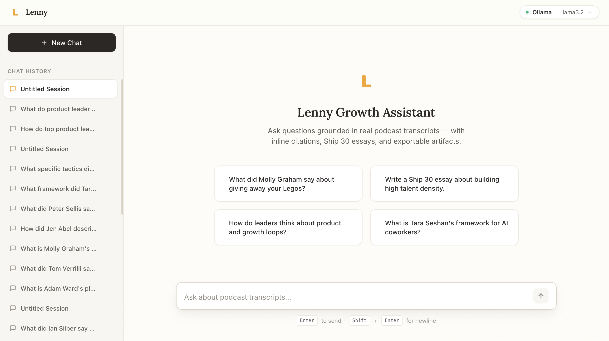
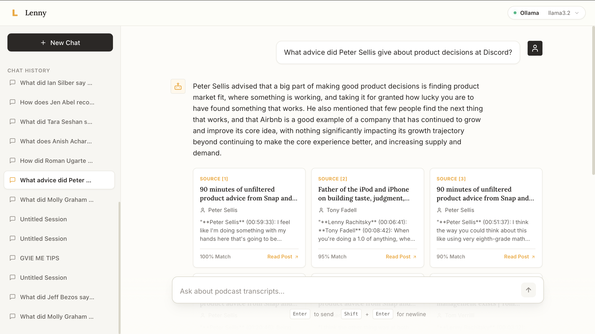
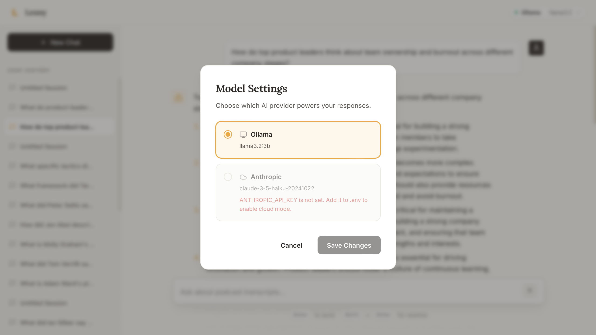
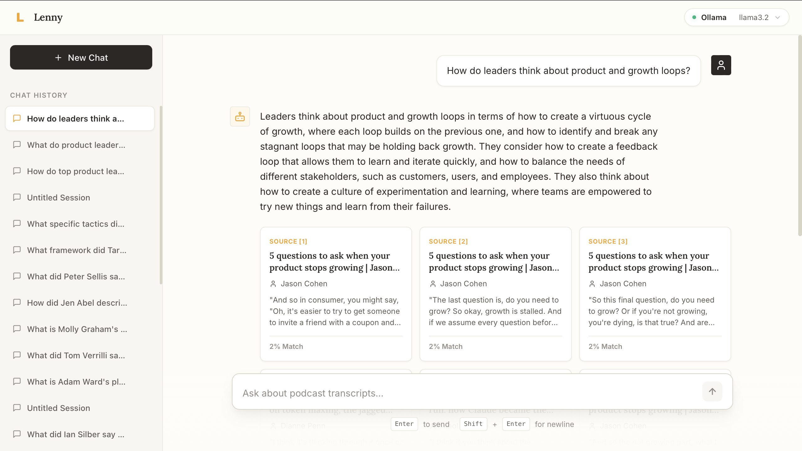

# Lenny Growth Assistant 🧠


A grounded, local-first product intelligence workspace for Product Managers. Built on top of **50 transcribed episodes** of Lenny's Podcast, this AI assistant is engineered to provide strictly factual, citable answers to complex product questions, completely eliminating hallucination.

---

## 📸 The Application in Action

*A fully polished, split-pane workspace designed for deep focus and research.*

### Main Conversational Interface

*A clean, distraction-free chat interface with chat history management.*

### Grounded Insights & Ship 30 Essays

*Strictly grounded answers pulling directly from podcast transcripts with inline citations.*

### Sandboxed Artifact Viewer

*A secure preview panel for generating and viewing standalone markdown and HTML artifacts.*

### Provider Settings & Cloud Fallbacks

*Run 100% locally via Ollama, or gracefully fall back to Anthropic Claude in the cloud.*

---

## 🚀 What This Project Does

Product managers, founders, and growth engineers often struggle to recall specific insights, mental models, or quotes from dense, hour-long podcast episodes. The **Lenny Growth Assistant** solves this by turning the podcast archive into an interactive, highly accurate oracle.

### Core Capabilities:
1. **Grounded Q&A with Inline Citations**: Ask a question like *"What did Molly Graham say about giving away your Legos?"* The agent will answer using **only** the transcribed context, providing clickable inline citations (e.g., `[1]`) that map to the exact speaker-turn chunk it used.
2. **Out-of-Corpus Refusal**: If you ask it a question not covered in the podcast (e.g., *"What is the capital of France?"*), the system detects this via vector distance thresholding and gracefully refuses, suggesting the closest topical episodes instead.
3. **Ship 30 for 30 Essay Generation**: A specialized pipeline that outlines, drafts, and structurally validates high-converting, 1,200-word essays formatted perfectly for online publishing—all grounded in the podcast data.
4. **Rich Artifacts**: The assistant can generate standalone markdown or HTML artifacts (like memos, templates, or checklists) and render them in a dedicated right-hand preview panel.

---

## 🧠 How It Works Under The Hood

The system relies on a complex, fully local RAG (Retrieval-Augmented Generation) pipeline using **FastAPI** and **Llama 3.2**.

### 1. Ingestion & Embedding
We process raw markdown transcripts into speaker-aware chunks (averaging 500 tokens with overlaps). These chunks are embedded using `nomic-embed-text` directly into a **PostgreSQL** database using the `pgvector` extension.

### 2. Hybrid Retrieval (RRF)
To guarantee we find the right context, we use a **Hybrid Search Engine**. When a user asks a question:
- **Vector Search**: Finds semantic matches based on embedding proximity.
- **Full-Text Search (FTS)**: Finds exact keyword matches (crucial for names or specific product acronyms).
The results are mathematically merged using **Reciprocal Rank Fusion (RRF)** to get the absolute best context chunks.

### 3. Prompt Injection Defense
The retrieved context is injected into the LLM prompt wrapped in `<UNTRUSTED_CONTEXT>` XML tags. The system prompt is engineered to heavily penalize the LLM if it hallucinates or follows instructions found within the untrusted transcripts.

### 4. Post-Generation Citation Validation
Before streaming the final results to the user, the backend runs a structural validation pass to ensure every single citation `[n]` emitted by the LLM corresponds mathematically to the chunks we retrieved. If it fabricated a citation, the chunk is flagged.

### 5. Secure Artifact Rendering
To prevent XSS (Cross-Site Scripting) attacks if the LLM generates malicious HTML, the frontend's Artifact Viewer utilizes a heavily restricted `iframe` (`sandbox=""` with no `allow-scripts` or `allow-same-origin`) combined with a strict Content-Security Policy.

---

## 🏗️ System Architecture

```text
┌─────────────┐       ┌───────────────────────────────────────────────┐
│  React+Vite │──────►│ FastAPI Backend                                 │
│  (port 3000)│◄──────│ (SSE Streams)                                 │
└─────────────┘       │                                               │
      │               │  ├── Query Rewriter                           │
      │               │  ├── Hybrid Retrieval (pgvector + FTS)        │
      │               │  ├── Prompt Router & Citation Validator       │
      │               │  └── Security (nh3 Sanitization)              │
      │               └───────────────────────────────────────────────┘
      │                               │                       │
┌─────▼───────┐               ┌───────▼─────────────┐ ┌───────▼─────────────┐
│ PostgreSQL  │◄──────────────│ Ollama (Local)      │ │ Anthropic (Cloud)   │
│ + pgvector  │               │ - llama3.2:3b       │ │ - claude-3-5-haiku  │
│ (port 5432) │               │ - nomic-embed-text  │ │ (Optional)          │
└─────────────┘               └─────────────────────┘ └─────────────────────┘
```

---

## 🛠️ Design Decisions & Trade-offs

Building a robust, local-first RAG pipeline requires careful architectural choices. Here is a breakdown of the key design decisions:

1. **Why Local First (Ollama)?**
   - *Cost & Privacy:* Running `llama3.2:3b` and `nomic-embed-text` locally ensures zero variable costs and complete data privacy for sensitive product research.
   - *Resilience:* The app falls back to Anthropic seamlessly if configured, but the core engine runs completely offline.

2. **Why PostgreSQL + pgvector?**
   - *Simplicity & Scale:* By keeping both relational data (Sessions, Messages, Artifacts) and vector data (Chunks, Embeddings) in the same datastore, we eliminate the need for a separate, complex vector database like Pinecone or Milvus. 
   - *Hybrid Search natively:* Postgres allows us to perform raw SQL queries that combine `tsvector` full-text search with `ivfflat` or `hnsw` vector distance calculations in a single transaction.

3. **Why Server-Sent Events (SSE) instead of WebSockets?**
   - *Unidirectional streaming:* For LLM token streaming, the data flows exclusively from Server to Client after the initial POST request. SSE provides a natively supported, resilient, and lightweight mechanism without the overhead and state-management complexity of full WebSockets.

---

## 🔄 Data Pipeline Deep-Dive

The ingestion engine is designed to intelligently parse markdown transcripts:
- **Speaker-Turn Awareness:** Instead of blindly chunking by character count (which destroys context), the chunker parses regex (`r'^\*\*(.+?)\*\* \((\d{2}:\d{2}:\d{2})\):'`) to group complete speaker thoughts.
- **Overlap & Padding:** Each chunk carries over a 50-token window from the previous chunk to maintain conversational context.
- **Idempotency:** The indexer uses a SHA-256 hash of the raw markdown. Running `make ingest` repeatedly will only re-embed episodes that have physically changed on disk.

---

## ⚡ Quick Start (One Command)

### Prerequisites
- **Docker Desktop** (with Compose v2)
- **Ollama** running locally on your host machine.

### Start the stack
```bash
git clone https://github.com/rajatmurhe/lenny-growth-assistant.git
cd lenny-growth-assistant

# 1. Pull the local models via Ollama
ollama pull llama3.2:3b
ollama pull nomic-embed-text

# 2. Boot all services
make up

# 3. Ingest the transcripts (Takes ~5-10 minutes)
make ingest

# 4. Open the app!
open http://localhost:3000
```

---

## ⚙️ Environment Variables

Copy `.env.example` to `.env` and configure to your liking.

| Variable | Required | Default | Description |
|----------|----------|---------|-------------|
| `POSTGRES_USER` | ✅ | `lenny` | Database username |
| `POSTGRES_PASSWORD` | ✅ | `lenny_secret` | Database password |
| `POSTGRES_DB` | ✅ | `lenny_db` | Database name |
| `OLLAMA_BASE_URL` | ✅ | `http://host.docker.internal:11434`| Connects container to host's Ollama |
| `OLLAMA_CHAT_MODEL` | ✅ | `llama3.2:3b` | Chat model to use |
| `ANTHROPIC_API_KEY` | ⬜ | - | Optional. Enables cloud provider if set |
| `RETRIEVAL_TOP_K` | ⬜ | `10` | Chunks retrieved per query |

---

## 🧪 Evaluation Framework

This project includes a rigorous automated evaluation suite designed to grade the system against 30 ground-truth questions. It measures:
1. **Hit Rate**: Are the correct source episodes in the top 10 retrieved chunks?
2. **Refusal Correctness**: Does the system properly refuse out-of-corpus questions?
3. **Citation Validity**: Does every output citation map to a real retrieved chunk?

Run the suite anytime using:
```bash
make eval
```

---

### The 30-Question Ground Truth
The evaluation uses a `questions.yaml` file containing:
- **Answerable Queries**: Direct questions like *"What did Molly Graham say about giving away your Legos?"*
- **Multi-hop Queries**: Broad questions requiring chunks from multiple episodes (e.g. *"How do top product leaders think about team ownership?"*)
- **Out-of-Corpus Refusals**: Trick questions (e.g. *"What did Jeff Bezos say about Amazon's flywheel?"*) designed to test the strict absolute cosine-distance thresholding.

---

## 🔮 Future Roadmap

While fully functional, here are the planned next steps for scaling the workspace:
1. **User Authentication:** Integrate Firebase or Supabase Auth for multi-user isolation.
2. **Cloud Deployment:** Include Terraform scripts for deploying the containerized stack to AWS ECS or GCP Cloud Run.
3. **Advanced Chunking:** Implement semantic chunking models instead of relying purely on speaker turns.
4. **Agentic Workflows:** Allow the LLM to recursively search the database if the initial RRF retrieval falls below the confidence threshold.

---

## 📜 License & Usage

- **Codebase**: MIT License.
- **Transcript Corpus** (`data/transcripts/`): Licensed under Lenny's starter pack terms (Personal and non-commercial use permitted; Raw redistribution not allowed). See `data/transcripts/LICENSE.md` for full details.
