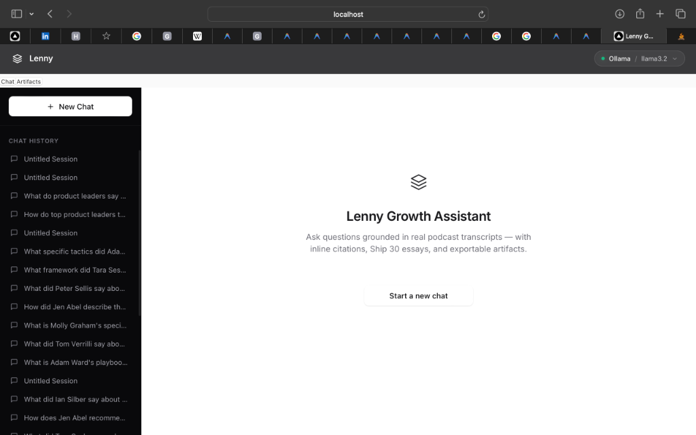
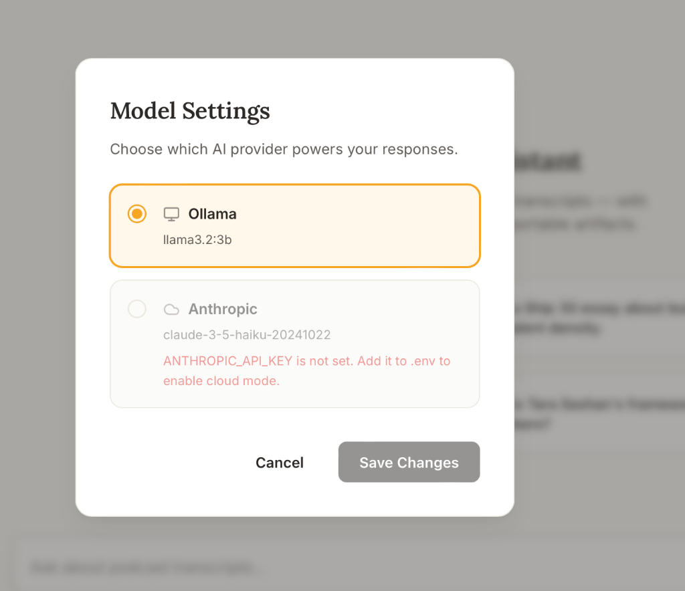

# Lenny Growth Assistant 🧠


A grounded, local-first product intelligence workspace for PMs. Built on **50 transcribed episodes** of Lenny's Podcast, this AI assistant answers complex product questions, drafts "Ship 30 for 30" style essays, and generates standalone markdown/HTML artifacts using a hybrid retrieval engine and the Llama 3.2 model.

---

## 📸 Screenshots

### Main Workspace

*The unified split-pane interface: Chat history (left), conversational agent with inline citations (center), and sandboxed artifact viewer (right).*

### Cloud Fallback & Health

*Graceful UI degradation. The app runs 100% locally via Ollama, but seamlessly supports Anthropic models if an API key is provided.*

---

## ✨ Features

- **Hybrid Search Engine**: Combines Full-Text Search (FTS) and `pgvector` embeddings with Reciprocal Rank Fusion (RRF) for high-precision context retrieval.
- **Strict Grounding**: The agent refuses to answer out-of-corpus questions (e.g. "What is the capital of France?") using absolute cosine distance thresholding.
- **Ship 30 Essay Generator**: A specialized pipeline that outlines, drafts, and structurally validates high-converting essays.
- **Secure Artifact Viewer**: A completely sandboxed rendering surface (no `allow-scripts`, no `allow-same-origin`) paired with server-side `nh3` sanitization to prevent XSS attacks.
- **Dual Providers (Local & Cloud)**: Built to run entirely offline via Ollama, with optional routing to Anthropic Claude.
- **Polished UI/UX**: Premium editorial theme, responsive layout, fluid CSS transitions, and SSE token streaming.

---

## 🏗️ Architecture

```text
┌─────────────┐       ┌───────────────────────────────────────────────┐
│  React+Vite │──────►│ FastAPI Backend                                 │
│  (port 3000)│◄──────│ (SSE Streams)                                 │
└─────────────┘       │                                               │
      │               │  ├── Query Rewriter                           │
      │               │  ├── Hybrid Retrieval (pgvector + FTS)        │
      │               │  ├── Prompt Router & Citation Validator       │
      │               │  └── Security (nh3 Sanitization)              │
      │               └───────────────────────────────────────────────┘
      │                               │                       │
┌─────▼───────┐               ┌───────▼─────────────┐ ┌───────▼─────────────┐
│ PostgreSQL  │◄──────────────│ Ollama (Local)      │ │ Anthropic (Cloud)   │
│ + pgvector  │               │ - llama3.2:3b       │ │ - claude-3-5-haiku  │
│ (port 5432) │               │ - nomic-embed-text  │ │ (Optional)          │
└─────────────┘               └─────────────────────┘ └─────────────────────┘
```

---

## 🚀 Quick Start (One Command)

### Prerequisites
- **Docker Desktop** (with Compose v2)
- **Ollama** running locally on your host machine.

### Start the stack
```bash
git clone https://github.com/rajatmurhe/lenny-growth-assistant.git
cd lenny-growth-assistant

# 1. Pull the local models via Ollama
ollama pull llama3.2:3b
ollama pull nomic-embed-text

# 2. Boot all services
make up

# 3. Ingest the transcripts (Takes ~5-10 minutes)
make ingest

# 4. Open the app!
open http://localhost:3000
```

---

## ⚙️ Environment Variables

Copy `.env.example` to `.env` and configure to your liking.

| Variable | Required | Default | Description |
|----------|----------|---------|-------------|
| `POSTGRES_USER` | ✅ | `lenny` | Database username |
| `POSTGRES_PASSWORD` | ✅ | `lenny_secret` | Database password |
| `POSTGRES_DB` | ✅ | `lenny_db` | Database name |
| `OLLAMA_BASE_URL` | ✅ | `http://host.docker.internal:11434`| Connects container to host's Ollama |
| `OLLAMA_CHAT_MODEL` | ✅ | `llama3.2:3b` | Chat model to use |
| `ANTHROPIC_API_KEY` | ⬜ | - | Optional. Enables cloud provider if set |
| `RETRIEVAL_TOP_K` | ⬜ | `10` | Chunks retrieved per query |

---

## 🧪 Testing & Evaluation

This project includes a rigorous automated evaluation suite for testing citation validity, retrieval hit rate, and prompt injection defense.

```bash
# Run the full testing suite (requires DB)
make test

# Run the 30-question Ground Truth Evaluation
make eval
```

---

## 🛠️ Make Commands

| Command | Action |
|---------|--------|
| `make up` | Start all services and run health checks. |
| `make down` | Tear down containers safely. |
| `make build` | Rebuild images from scratch. |
| `make ingest` | Run the chunking and vector embedding pipeline. |
| `make shell-backend` | Bash into the running backend. |
| `make shell-db` | Launch `psql` in the running database. |

---

## 📜 License & Usage

- **Codebase**: MIT License.
- **Transcript Corpus** (`data/transcripts/`): Licensed under Lenny's starter pack terms (Personal and non-commercial use permitted; Raw redistribution not allowed). See `data/transcripts/LICENSE.md` for full details.
